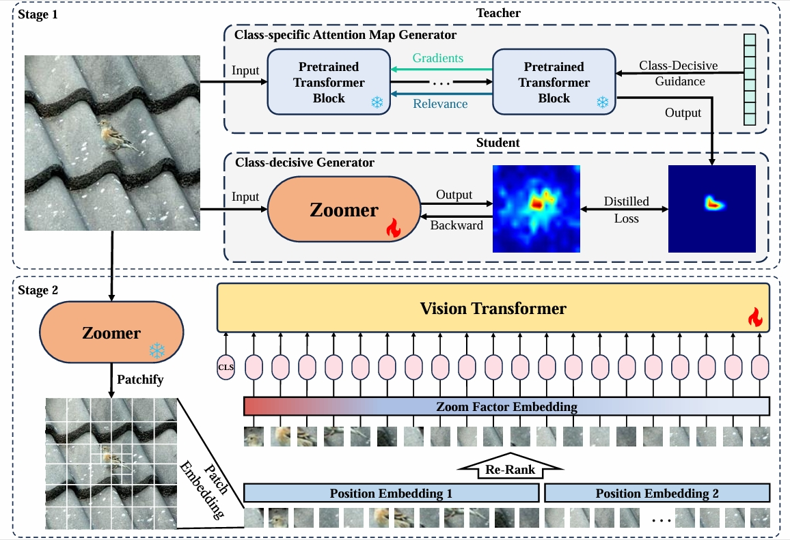

# Vision Transformers Need Zoomer: Efficient Vision Transformers with Local Zooming 🌟

Welcome to **Vision Transformers Need Zoomer**! This repository contains PyTorch evaluation and training code, along with pretrained models for our innovative projects. Our models achieve impressive trade-offs in speed and precision, making them suitable for a variety of applications. 🚀



## Model Zoo 🦙

Explore our baseline **DeiT** models pretrained on ImageNet 2012:

| Model Name                           | Acc@1 | Acc@5 | Parameters | Download Link                                   |
|--------------------------------------|-------|-------|------------|-------------------------------------------------|
| ZoomViT-small-ZF2                    | 83.8  | 96.9  | 22.7M      | [Baidu Netdisk](https://pan.baidu.com/s/1V-E5rMBkV16L5pEGw-Vs0Q?pwd=heji) |
| ZoomViT-small-ZF0.5                  | 81.5  | 95.7  | 22.7M      | [Baidu Netdisk](https://pan.baidu.com/s/1Q1BtI0kNA3kdp9t6KLKb4w?pwd=28zg) |
| Zoomer                                | -     | -     | -          | [Baidu Netdisk](https://pan.baidu.com/s/1YibKamJqV73TXa_s1BJfxA?pwd=6k51) |

## Data Preparation 📂

To get started, download and extract the ImageNet training and validation images from [ImageNet](http://image-net.org/). Organize your directory as follows, which is compatible with the torchvision [`datasets.ImageFolder`](https://pytorch.org/docs/stable/torchvision/datasets.html#imagefolder):

```
/path/to/imagenet/
  train/
    class1/
      img1.jpeg
    class2/
      img2.jpeg
  val/
    class1/
      img3.jpeg
    class2/
      img4.jpeg
```

## Evaluation 🔍

To evaluate the pretrained **DeiT-small-ZF2** on the ImageNet validation set with a single GPU, run:

```bash
python main.py --eval --resume output/best_checkpoint_zf2.pth --data-path /path/to/imagenet
```

This should yield the following results:

```
* Acc@1: 83.816  Acc@5: 96.928  Loss: 0.618
```

For **DeiT-small-ZF0.5**, execute:

```bash
python main.py --eval --resume output/best_checkpoint_zf0.5.pth --data-path /path/to/imagenet
```

And expect:

```
* Acc@1: 81.480  Acc@5: 95.742  Loss: 0.730
```

## Training ⚙️

Stay tuned! The training framework for **Zoomer** will be released soon. 

## License 📜

This repository is released under the **Apache 2.0 license**.

## Contributing 🤝

We actively welcome your contributions! If you're interested in improving the project, feel free to submit pull requests. For more information, check our contributing guidelines.
